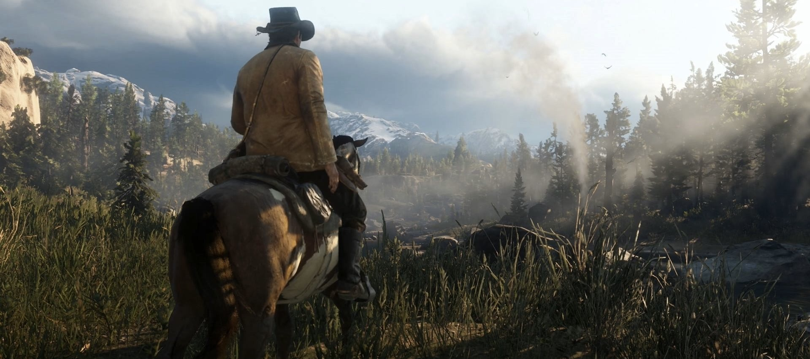

# 🧠 Real/Fake Image Classification App

This is a Streamlit web application designed to classify images as either **real** or **AI-generated (fake)**.

The app is part of a **supervised learning project** led by **Nadia Urban** at **Shanghai Thomas School**, where students learn how to design and deploy machine learning models through hands-on, real-world problems.

---

## 🎓 Project Overview

This project follows five main stages:

1. **Model Design** – Planning the classification task and defining real vs. fake  
2. **Data Collection** – Gathering images from Baidu, Kaggle, and generating with ChatGPT  
3. **Model Training** – Using Google’s Teachable Machine to train a CNN classifier  
4. **Model Assessment** – Evaluating balance and prediction accuracy  
5. **Web App Design** – Deploying the model in an interactive Streamlit app

---

## 🛠️ App Description

This app helps users identify whether an image is **authentic** or **AI-generated**, which can be useful for understanding media credibility and the capabilities of modern generative tools.

### 🧾 Model Information
- **Classes:**
  1. Fake – AI-generated or manipulated images  
  2. Real – Genuine photographs
- **Goal:** 🎯 To develop a model that can distinguish between real and fake images  
- **Data Type:** 🖼️ JPEG and PNG image files  
- **Data Source:** 🌐 Images from **Baidu**, **Kaggle**, and generated using **ChatGPT**  
- **Training:** 🏋️ Teachable Machine  
- **Model Type:** 🧠 Convolutional Neural Network (CNN)

---

## 🖼️ Training Data Samples

| Class | Image Preview     | Number of Training Images |
|-------|--------------------|----------------------------|
| Fake  |  | 4,303 photos               |
| Real  |  | 406 photos                 |

(*These preview images are displayed in the app sidebar.*)

---

## 👩‍🔬 Model Authors

- **高维远 (Evan Gao)**  
- **杨淳涵 (Harry Yang)**

---

## ✨ Credits

This project was developed as part of the **AI & Machine Learning program** at **Shanghai Thomas School**, designed and taught by **Nadia Urban**.

---

## 🚀 Deployment

The app is deployed using [Streamlit Cloud](https://streamlit.io/cloud) and can also be run locally by installing the required dependencies:

```bash
pip install streamlit tensorflow pillow numpy
streamlit run app.py
